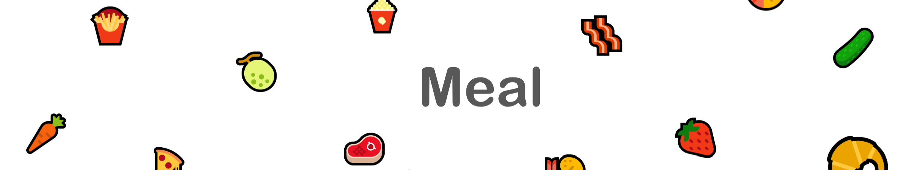
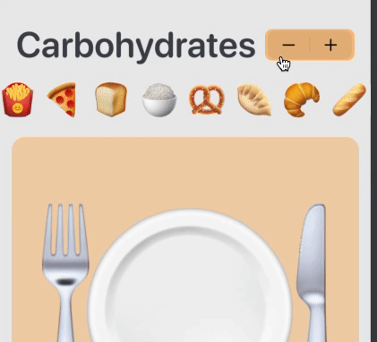

 
Submission for WWDC2021

Steps to play with the playground:
1. Download and unzip the file
2. Open Meal.playground with Xcode
3. You will see two Playground pages: Nutrition Info and Choose Food
4. Run the code in Nutrition Info
5. After finishing with Nutrition Info, run the code in Choose Food
6. Have fun!
 
---

# It is meal time now!👋
 
 This playground aims to give a foundational understanding of nutrition to children and teenager. Thus, encouraged them to have a healthy combination of food in every meal.
 
 
 ## Your Online Nutritionist Friend 🤓🍔
 
 As a gentle introduction about nutrition, this playground introduce a friend that knows a lot about nutrition to children. From my observation, children is more engaged in game-like activities and thus remember information introduced in the game more.
 

# It is now time to choose your food 😋
 
 This page aim to give a brief evaluation of chosen food for a meal. It allows drag-drop food from the top to the plate area in the middle, and evaluate the food after hitting the "Check" button. Have fun and test out your favorite meal!
 
 * Callout(Tip💡):
 If you find trouble with drag-and-drop, click the food emoji, hold for 0.1s, drag into the plate area, find a spacy area to drop your food, the food should have a green + sign on the top left now, then drop it.
 
 
 
 ---
 
 ## Choose Food From Every Type Of Nutrients 🥐 🥩 🥛 🌿
 
 Choosing at least one food from each type of nutrients ensure you have all the energy and vitamin you need for a healthy life. Eating junk food can be healthy if you eat in a small amount and pair it with protein and vegetables!
 
 * Callout(Tip💡):
 See more food by swiping left and right on the food bar.
 
 * Callout(Tip💡):
 Change to other type of nutrients by clicking plus + and minus - button on the top left corner.
 
 ---
 
 ## Enjoy and Have Fun 🥳
 
 Nice to see you today. I hope this help you to eat well and keep your awesome body in its best shape!
 
 * Hint:
 Try 🍚 with 🍤 and 🥒. Yummy combination.
 
 
 ---

## Credits and Thanks 🙏
 
  - [Canada Food Guide](https://food-guide.canada.ca/en/) for creative and informative nutrition information
  - [Alberta Health Services Nutrition Lesson](https://www.albertahealthservices.ca/nutrition/Page2918.aspx) for interesting ideas to introduce nutrition for kids
  - [Developing Apps for iOS Course](https://cs193p.sites.stanford.edu) for ideas about implementation
 ---

